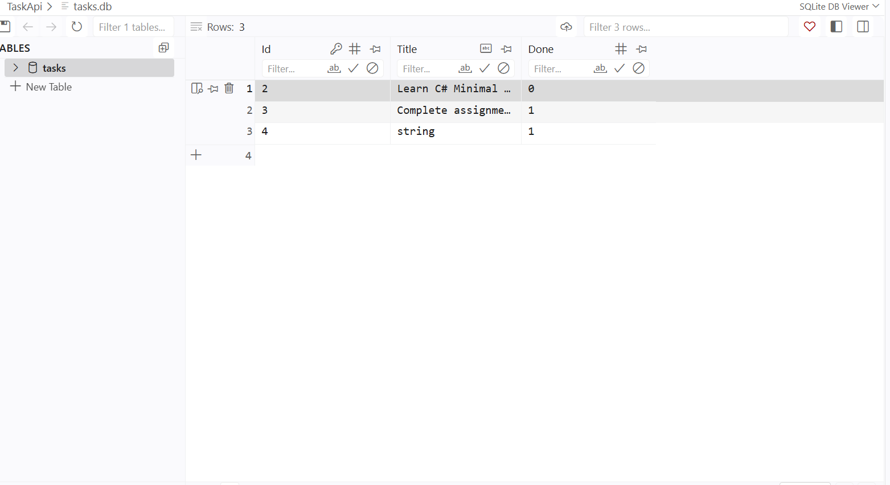
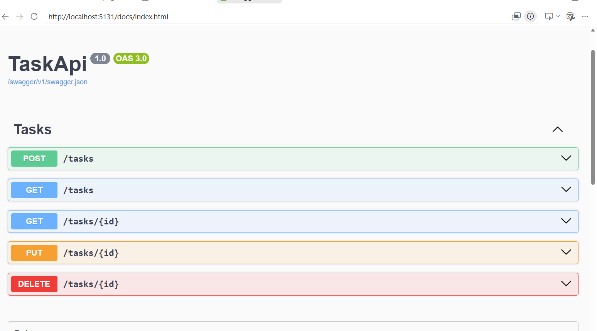
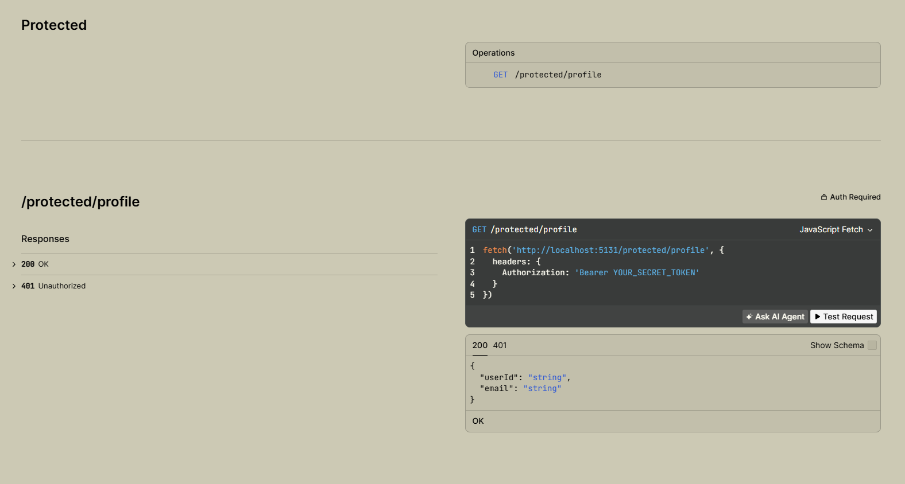
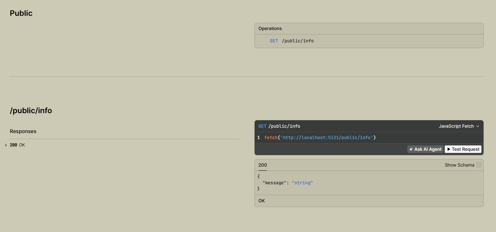

# TaskApi

TaskApi is a minimal ASP.NET Core task management API backed by PostgreSQL and Entity Framework Core.

## Why PostgreSQL?

PostgreSQL was chosen to provide a reliable relational database for the containerized application, including strong typing, durable storage, and support for concurrent API requests. The database runs in its own PostgreSQL container and is managed by Entity Framework Core through the Npgsql provider.

## Database storage

The Docker connection string is configured through `.env` and points the API to the `db` service:

```text
Host=db;Port=5432;Database=taskdb;Username=postgres;Password=your_password_here
```

PostgreSQL data is stored in the named Docker volume `postgres_data`, mounted at `/var/lib/postgresql/data` inside the database container. The database schema and initial seed data are created by `scripts/init.sql` when the database volume is initialized for the first time.

## Data access and API surface

This project does not define a custom repository interface or repository class. `AppDbContext` and its `DbSet<TaskEntity>` provide the Entity Framework Core data-access abstraction, and the feature handlers use the context directly. The data source was migrated from in-memory storage to PostgreSQL by changing the dependency-injection configuration to `UseNpgsql()` in `Program.cs`.

The application services and routes remained unchanged. Only the underlying EF Core provider and database configuration changed, so the existing task API behavior is preserved while data now survives container restarts.

## How to Start the Project

### Prerequisites

* [.NET 8 SDK](https://dotnet.microsoft.com/download) or later installed.

### Steps to Run

1. Navigate to the project root directory:

   ```bash
   cd TaskApi
   ```

2. Start the API:

   ```bash
   dotnet run
   ```

   When running through Docker, PostgreSQL is initialized and seeded with 3 example tasks on the first database-volume initialization.

3. Open Swagger UI in your browser.

   Check the terminal console output for the local URL, typically `http://localhost:5131/swagger`.

## Database viewer screenshot

Add a screenshot of the PostgreSQL database viewer below. Replace the placeholder path with the image file you add to the repository.

<!-- Replace the path below with the PostgreSQL database viewer screenshot. -->


## Swagger UI screenshot

Add a screenshot of the Swagger UI below. Replace the placeholder path with the image file you add to the repository.

<!-- Replace the path below with the Swagger UI screenshot. -->




## Example Entity Framework Core query

The following SQL query was executed against PostgreSQL to list incomplete tasks, newest first:

```sql
SELECT id, title, done
FROM tasks
WHERE done = FALSE
ORDER BY id DESC;
```

The equivalent Entity Framework Core query used by the API is:

```csharp
var tasks = await db.Tasks
    .AsNoTracking()
    .Where(task => !task.Done)
    .OrderByDescending(task => task.Id)
    .ToListAsync(cancellationToken);
```

## Persistence verification

Persistence was checked through Swagger UI at <http://localhost:5131/docs> by creating a task with `POST /tasks`, noting its generated ID from the `201 Created` response, and confirming it with `GET /tasks/{id}`. The containers were then stopped and removed with `docker compose down`, without deleting the named `postgres_data` volume. After starting the stack again with `docker compose up -d`, the same task was requested through `GET /tasks/{id}` and was still present.

Do not use `docker compose down -v` for this check because that command deletes the PostgreSQL volume and its data.

## Run with Docker

### Prerequisites

* [Docker Desktop](https://www.docker.com/products/docker-desktop/) installed and running.

### Steps to Run

1. Create the Docker environment file from the provided template:

   ```bash
   copy .env.example .env
   ```

   On macOS or Linux, use `cp .env.example .env` instead. Update the PostgreSQL password values in `.env` before starting the containers.

2. Build the image and start the API and database containers:

   ```bash
   docker compose up --build
   ```

3. Open Swagger UI at <http://localhost:5131/swagger>.

4. Stop the containers with `Ctrl+C`, or run the following command from another terminal:

   ```bash
   docker compose down
   ```

To view the application logs while the containers are running, use:

```bash
docker compose logs -f app
```
